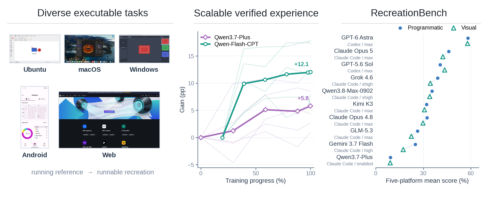
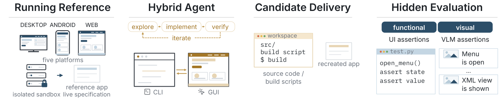

<h1 align="center"><br>RecreationWorld</h1>

<p align="center"><em>Scalable and Verifiable Environments for Hybrid Computer-Use Agents</em></p>

<p align="center"><a href="https://recreation-bench.cc">Website</a> · <a href="assets/report.pdf">Report</a> · <a href="https://huggingface.co/datasets/Qwen/RecreationBench">Hugging Face</a> · <a href="https://modelscope.cn/datasets/Qwen/RecreationBench">ModelScope</a></p>

<p align="center"><a href="#recreationbench-results">Results</a> · <a href="#quickstart">Quickstart</a> · <a href="#citation">Citation</a></p>

## Overview

RecreationWorld is a five-platform framework for studying and improving **hybrid computer-use agents** that autonomously interleave GUI exploration, implementation with coding tools, and visual verification of their own running artifacts. By framing recreation around a running reference as an executable oracle, it turns open-source applications into scalable, verifiable training experience that transfers beyond recreation, while RecreationBench provides 250 held-out tasks with reference-grounded programmatic and visual evaluation.



## Recreation workflow

Each task gives the agent a high-level request, interactive access to a running reference, and both GUI-control and software-development tools. The agent decides when to explore the reference, implement source code, build and launch its candidate, inspect the result, and revise it—forming a recurring **explore–implement–verify** loop rather than a fixed sequence of stages.



The final candidate is evaluated by a frozen suite of reference-validated programmatic and visual assertions. Scoring depends on observable behavior rather than source-level similarity, so implementations remain free to use different languages, frameworks, and architectures.

## RecreationBench Results

Scores are macro-averaged within each platform and then equally weighted across platforms. Average is the unweighted mean of Prog and VLM; estimated costs assume 90% cache reads.

| Model | Prog (%) | VLM (%) | Average (%) | Prog ≥90% (% apps) | Prog =100% (% apps) | Estimated cost (USD/task) |
| --- | ---: | ---: | ---: | ---: | ---: | ---: |
| GPT-6 Astra | 58.19 | 57.92 | 58.06 | 17.60 | 2.80 | 115.80 |
| Claude Opus 5 | 45.99 | 42.34 | 44.16 | 5.53 | 0.80 | 117.17 |
| GPT-5.6 Sol | 40.63 | 43.49 | 42.06 | 5.20 | 0.40 | 25.46 |
| Grok 4.6 | 39.02 | 34.45 | 36.73 | 1.60 | 0.00 | 12.58 |
| Qwen3.8-Max-0902 | 35.53 | 34.07 | 34.80 | 2.00 | 0.00 | 38.76 |
| Kimi K3 | 32.07 | 30.74 | 31.41 | 2.00 | 0.00 | 63.10 |
| Claude Opus 4.8 | 32.40 | 29.81 | 31.10 | 1.60 | 0.40 | 69.16 |
| GLM-5.3 | 26.30 | 22.46 | 24.38 | 2.00 | 0.00 | 70.98 |
| Gemini 3.7 Flash | 24.91 | 17.34 | 21.12 | 2.40 | 0.00 | — |
| Qwen3.7-Plus | 9.18 | 9.12 | 9.15 | 0.00 | 0.00 | 1.23 |

## Quickstart

Install [uv](https://docs.astral.sh/uv/), then run from the repository root:

```bash
uv sync
uv run rb run --help
```

A scored run also needs a matching frozen task bundle from [Hugging Face](https://huggingface.co/datasets/Qwen/RecreationBench) or [ModelScope](https://modelscope.cn/datasets/Qwen/RecreationBench), a prepared execution environment, and model and judge endpoints.
Choose a platform for setup and batch runs:

| Platform | Tasks | Evaluation interface | Setup and run |
| --- | ---: | --- | --- |
| Ubuntu | 50 | AT-SPI | [Linux guide](docs/providers/linux.md) |
| macOS | 50 | AXUIElement | [macOS guide](docs/providers/macos.md) |
| Windows | 50 | UI Automation | [Windows guide](docs/providers/windows.md) |
| Android | 50 | UiAutomator | [Android guide](docs/providers/android.md) |
| Web | 50 | Browser assertions | [Web guide](docs/providers/web.md) |

The canonical task index is in [`tasks/`](tasks/).

To verify the checkout, run these offline checks; they do not require benchmark data or credentials:

```bash
uv run python scripts/release/smoke_providers.py
uv run python scripts/release/smoke_runtime.py
```

If you have any questions, please contact [xiezhihui.xzh@alibaba-inc.com](mailto:xiezhihui.xzh@alibaba-inc.com) or [gaochang.gao@alibaba-inc.com](mailto:gaochang.gao@alibaba-inc.com).

## Citation

If you find this environment useful, please consider citing:

```bibtex
@article{qwen2026recreationworld,
  title  = {RecreationWorld: Scalable and Verifiable Environments for Hybrid Computer-Use Agents},
  author = {Shuai Bai and Jiayong Deng and Yikun Fu and Chang Gao and Xuhao Hu and Mianqiu Huang and Yizhen Jiang and Yuheng Jing and Dehui Kong and Keliang Li and Ning Li and Wanli Li and Dayiheng Liu and Dunjie Lu and Changwei Luo and Que Shen and Zheyuan Wang and Zijian Wang and Jie Wu and Gao Wu and Zhihui Xie and Rui Xie and Haiyang Xu and An Yang and Jiakang Yuan and Yanming Zhang and Jiajun Zhang and Xi Zhang and Zhenru Zhang and Zhuo Zhen and Mingkang Zhu and Bowen Zhou},
  year   = {2026}
}
```

Released under the [MIT License](LICENSE). Third-party components retain their upstream licenses; see [`THIRD_PARTY_NOTICES.md`](THIRD_PARTY_NOTICES.md).
