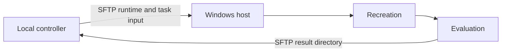

# RecreationBench Windows provider

The Windows controller runs evaluation on a user-managed Windows host.
It transfers the repository-root runtime and local evaluation input over SSH/SFTP and
does not require a scheduler, model proxy, or object-store service.



## Target requirements

- Windows 10/11 or Windows Server with an active interactive desktop.
- OpenSSH Server reachable from the controller.
- Python 3.12 and the packages in `provision/requirements.windows.txt`.
- Node.js, the selected agent CLI, and Qwen CUA Driver 0.7.3.

On the target, run:

```powershell
powershell -ExecutionPolicy Bypass -File provision/Provision-RecreationBenchWindows.ps1
powershell -ExecutionPolicy Bypass -File provision/Verify-RecreationBenchWindows.ps1
```

## Configure

```bash
cd <repo>/providers/windows/template
cp .env.example .env.windows
uv venv
source .venv/bin/activate
uv pip install -r requirements.txt
```

Set the Windows SSH connection, agent-model endpoint, visual-judge endpoint, and
`RB_UNIFIED_LOCAL_DIR`. Accepted input layouts include:

```text
<root>/windows/<task-id>/instance.json
<root>/windows/<task-id>/reference/
<root>/windows/<task-id>/tests/
```

The controller also accepts `<root>/<task-id>/...` and fails immediately when the
task is missing.

The provisioning script installs the pinned Python and agent dependencies once.
The template therefore defaults `RB_WINDOWS_SKIP_DEP_INSTALL=1` and
`RB_WINDOWS_SKIP_AGENT_INSTALL=1`; set either variable to `0` only when intentionally
refreshing a target from the public package registries.

## Run

```bash
python run_one.py \
  --task-id <windows-task-id> \
  --stage recreation_eval \
  --unified-dir /path/to/released-dataset
```

Supported stages are `setup`, `recreation`, `eval`, and
`recreation_eval`. Run a group with:

```bash
python run_many.py \
  --tasks-file ../../../tasks/windows.jsonl \
  --unified-cache-dir /path/to/released-dataset \
  --concurrency 2 \
  --out-dir parallel_results
```

For stages other than `setup`, the runner verifies an active desktop and
`explorer.exe`. Use `--skip-desktop-preflight` only after verifying the desktop by
another method.

Each result directory contains `metrics.json`, logs, trajectory, recreated artifacts,
and tool-use screenshots. The controller retrieves the complete directory over SFTP.

See the [Windows run guide](../../docs/providers/windows.md) for the concise setup path.
